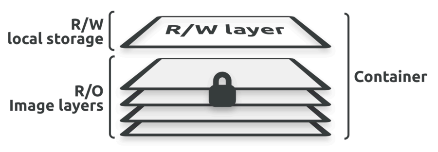
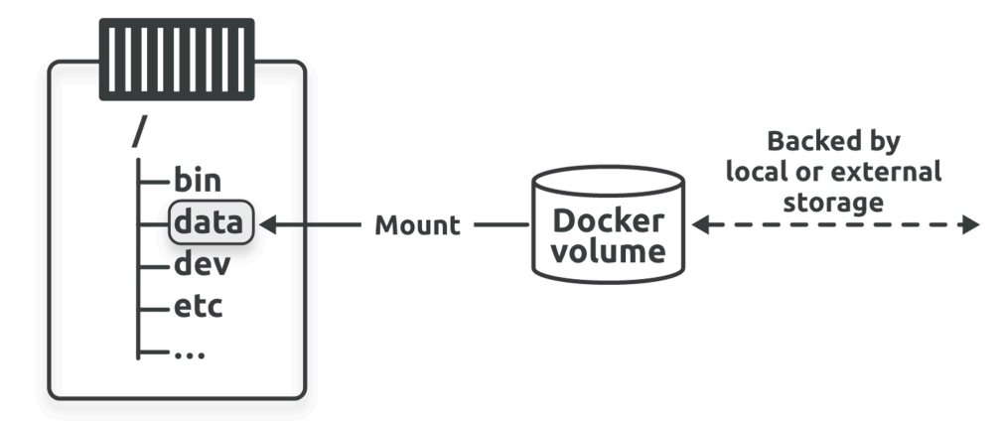
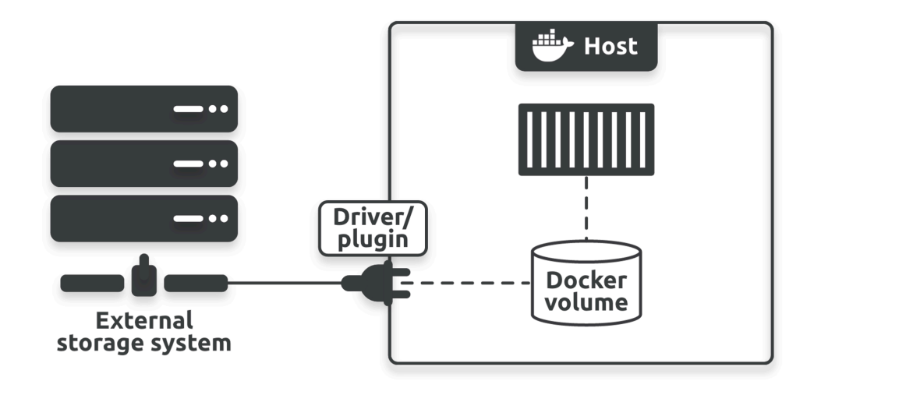

# Docker-Ultimate-Guide
The only source you need to learn and practice Docker, Dockerfile, Docker-Compose, Docker Swarm, DockerStack


# Docker Volumes



## Introduction
Docker volumes are a mechanism for persisting data generated and used by Docker containers. They allow data to be stored on the host machine and shared with containers, ensuring that important data is not lost when a container is removed. 

When Docker creates a container, it uses a layered filesystem with both read-only and read-write layers. Data written to the read-write layer is lost when the container is deleted. To retain this data, Docker volumes are used to store it on the host machine.

## How Docker Volumes Work
Imagine a Docker volume as a box where you can safely store items. This box is created independently of containers. When a container (think of it as a workspace) is set up, the volume can be attached to a specific location (directory) within the container.



- **Persistence:** If the container is deleted, the volume and its contents remain intact on the host machine.
- **Portability:** The volume can be connected to different containers, allowing data to be easily shared and reused.

## Docker Volume Commands
Here are some common Docker volume commands:

```bash
# Create a new volume named "my-vol"
docker volume create my-vol

# List all Docker volumes
docker volume ls

# Inspect details of a specific volume
docker volume inspect my-vol

# Remove a specific volume
docker volume rm my-vol

# Remove all unused volumes
docker volume prune
```

> **Warning:** The `docker volume prune` command deletes all volumes not currently used by containers. Use it with caution, as it can result in data loss.

## External Storage Options
In addition to local volumes, Docker supports the use of external storage solutions, such as cloud storage, for storing data. This allows for greater flexibility and scalability in managing persistent data.




---


# Example How To Use Volumes:

####  Creating a Volume, Mounting it to a Container, and Accessing Data

### Understanding the Process
Before we dive into the steps, let's recap:
* **Volume:** A persistent storage area managed by Docker.
* **Mounting:** Connecting a local path to a specific point within a container's filesystem.
and it is like :

*   ```bash
    docker run -v <host_path>:<container_path> <image_name>
    #Don't get confused with the order of the host_path and container_path
    ```

### Steps

#### 1. Create a Volume
* Open your terminal or command prompt.
* Run the following command to create a volume named `my-volume`:
  ```bash
  docker volume create my-volume
  ```

#### 2. Create a Docker Container
* Choose a base image for your container. For this example, we'll use `ubuntu`.
* Run the following command to create a container named `my-container` and mount the `my-volume` to the `/data` directory inside the container:
  ```bash
  docker run -it --name my-container -v my-volume:/data ubuntu /bin/bash
  ```
  * `-it`: Runs the container in interactive mode with a terminal.
  * `--name my-container`: Assigns the name `my-container` to the container.
  * `-v my-volume:/data`: Mounts the volume `my-volume` to the `/data` directory inside the container.

#### 3. Accessing the Volume from the Container
* You're already inside the container from the previous step.
* You can now create, read, write, or delete files within the `/data` directory. These changes will be persisted in the volume.
  ```bash
  # Create a file
  touch /data/my_file.txt
  # Write to the file
  echo "Hello from container" > /data/my_file.txt
  ```

#### 4. Accessing the Volume from the Host
* Find the mount point of the volume on your host machine. This can vary depending on your Docker setup but is typically under `/var/lib/docker/volumes`.
* Navigate to the mount point and you can access the files directly.
  ```bash
  # Assuming the mount point is /var/lib/docker/volumes/my-volume/_data
  cd /var/lib/docker/volumes/my-volume/_data
  cat my_file.txt
  ```

### Important Notes
* Changes made to the volume from either the container or the host will be reflected in both places.
* You can mount the same volume to multiple containers.
* To remove a volume, use the following command:
  ```bash
  docker volume rm my-volume
  ```


 

